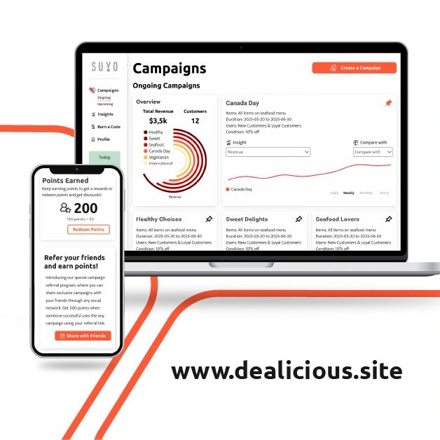
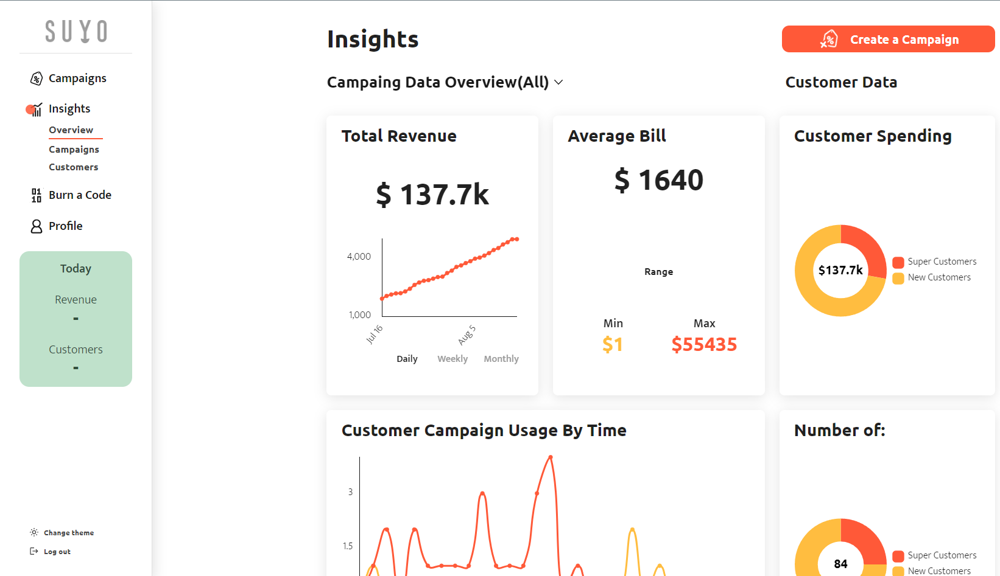

# Dealicious - Web App to create referral marketing campaigns using AI and data analysis

## Getting Started
A sophisticated web platform tailored for food businesses seeking innovative solutions to craft exceptional referral marketing campaigns and loyalty programs. Our platform harnesses the power of cutting-edge data analysis and AI tools to elevate your business strategies.

## Key Features
- **Referral Marketing Campaigns:** Our platform offers a seamless experience for designing and executing referral marketing campaigns that drive customer engagement and growth.
- **Loyalty Programs:** Elevate customer loyalty with tailored loyalty programs that keep your customers coming back for more.
- **Data Analysis and AI:** Leverage powerful data analysis and AI tools to gain valuable insights into customer behavior and campaign effectiveness.
- **Data Visualization:** Visualize your campaign performance with the integrated Chart.js library, providing comprehensive data representations.
- **SMS Verification:** Ensure security and authenticity with Twilio's SMS verification for a seamless user registration process.
- **AI-Generated Advertisements:** Harness the potential of OpenAI to generate compelling campaign advertisements effortlessly.

## Tech Stack
- **Next.js:** Our choice of framework for building both the front-end and server-side backend, offering a powerful foundation for dynamic web applications.
- **Material-UI:** Styling our front-end components with Material-UI to deliver an elegant and responsive user interface.
- **Node.js:** Handling the backend logic and API endpoints with Node.js, ensuring smooth data flow and user interactions.
- **MongoDB:** Utilizing MongoDB as our NoSQL database solution for efficient and scalable data storage.
- **Cloudinary:** Seamlessly managing image storage and retrieval with Cloudinary's robust integration.
- **Chart.js:** Integrating Chart.js for data visualization, enabling insightful representations of campaign performance.
- **Twilio:** Ensuring secure user registration with Twilio's SMS verification service, enhancing user trust.
- **OpenAI:** Leveraging the capabilities of OpenAI for generating compelling and engaging campaign advertisements.

